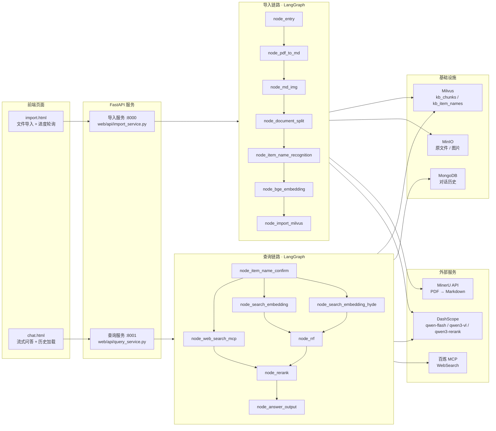

# 掌柜智库 · 智能知识库问答系统

> 基于 **LangGraph + RAG** 的多模态知识库问答系统:把产品说明书(PDF/Markdown)自动解析、切片、向量化入库,再通过「主体名确认 → 多路召回 → RRF 融合 → 重排 → 大模型生成」的完整链路,回答用户针对具体产品型号的售后/使用类问题。

<p>
  
  
  
  
  
</p>

---

## 目录

- [一、项目简介](#一项目简介)
- [二、核心特性](#二核心特性)
- [三、系统架构](#三系统架构)
- [四、技术栈](#四技术栈)
- [五、业务流程详解](#五业务流程详解)
- [六、目录结构](#六目录结构)
- [七、快速开始](#七快速开始)
- [八、环境变量说明](#八环境变量说明)
- [九、API 接口文档](#九api-接口文档)
- [十、数据模型](#十数据模型)
- [十一、单节点调试](#十一单节点调试)
- [十二、已知问题与改进方向](#十二已知问题与改进方向)
- [十三、项目信息](#十三项目信息)

---

## 一、项目简介

本系统面向**家电 / 工业设备类产品说明书**场景。这类文档的特点是:

- 内容长、图文混排(PDF 转 Markdown 后带大量插图);
- 用户提问高度依赖**具体产品型号**(「HAK180 怎么调温度」和「HAK200 怎么调温度」是两个不同答案);
- 用户提问往往是**口语化、指代模糊**的(「这个怎么调?」)。

针对以上特点,项目做了三件关键的事:

1. **导入侧**:PDF 经 MinerU 结构化解析为 Markdown,用多模态大模型为插图生成中文摘要并上传 MinIO,再用 LLM 识别文档主体名(商品型号),最后以 **BGE-M3 稠密 + 稀疏混合向量**写入 Milvus。
2. **查询侧**:先用 LLM 从当前问题 + 历史对话中抽取并**对齐**主体名——只识别到一个则继续检索,识别到多个则**反问用户澄清**,一个都没有则**拒绝回答**;主体确定后并发执行三路召回,再做融合与重排。
3. **工程侧**:全链路用 LangGraph 编排,每个节点独立可测;任务进度通过内存态任务表 + SSE 实时推送到前端。

---

## 二、核心特性

| 能力 | 说明 |
| --- | --- |
| 双链路 LangGraph 编排 | 导入链路 7 节点、查询链路 7 节点,全部以 `StateGraph` 编排,节点可单独运行调试 |
| MinerU 结构化解析 | 调用 MinerU `vlm` 模型把 PDF 转成结构化 Markdown,支持批量上传 + 轮询 + 超时控制 |
| 多模态图片理解 | `qwen3-vl-flash` 结合图片**上下文文字**为插图生成中文摘要,写入 Markdown 图片 alt,同时上传 MinIO 并替换本地路径 |
| 混合向量检索 | BGE-M3 同时产出 dense(1024 维)+ sparse 向量,Milvus `hybrid_search` + `WeightedRanker` 加权融合 |
| HyDE 增强召回 | LLM 先生成「假设性答案」,再与用户问题拼接后检索,缓解短 query 与长文档的语义鸿沟 |
| MCP 联网搜索 | 通过 Model Context Protocol(百炼 WebSearch Server)接入外部搜索,补充知识库外的信息 |
| 主体名确认与反问 | 型号歧义时反问、查无此型号时拒答,避免答非所问和幻觉 |
| RRF + 重排 + 断崖截断 | 先 RRF 融合多路结果,再用 Cross-Encoder 精排,最后按相邻分差动态截断 TopK |
| SSE 流式输出 | 大模型增量以 `delta` 事件推送,结束推 `final`(含图片 URL),前端逐字渲染 |
| 全流程进度追踪 | 节点名 → 中文名映射,前端可轮询 `/status/{task_id}` 看到「PDF转Markdown → 文档切分 → 向量生成…」实时进度 |
| 幂等入库 | 入库前按 `file_title` / 文档目录清理旧数据,同一份文档重复导入不会产生脏数据 |
| 会话历史持久化 | MongoDB 存储多轮对话,查询节点会回读历史做问题改写,支持清除会话 |

---

## 三、系统架构



> 说明:导入服务与查询服务是**两个独立进程**(分别占用 8000 / 8001 端口),通过共享的 Milvus / MongoDB / MinIO 协作。任务进度表(`utils/task_utils.py`)是进程内存态,因此单个服务请勿多 worker 启动。

---

## 四、技术栈

| 层次 | 选型 |
| --- | --- |
| 工作流编排 | LangGraph (`StateGraph`,条件边 / 并发分支 / 虚拟汇聚节点) |
| 大模型调用 | `langchain-openai`(DashScope OpenAI 兼容模式)、原生 `openai` SDK |
| 生成模型 | `qwen-flash`(问答 / 主体名抽取 / HyDE)、`qwen3-vl-flash`(图片理解) |
| 向量模型 | `BAAI/bge-m3`(dense + sparse,PyMilvus `BGEM3EmbeddingFunction`,fp16 + CUDA) |
| 重排模型 | `qwen3-rerank`(DashScope `TextReRank` API) |
| 向量数据库 | Milvus(`hybrid_search` + `WeightedRanker`,AUTOINDEX + SPARSE_INVERTED_INDEX) |
| 文档存储 | MongoDB(会话历史)、MinIO(原始文件 + 图片对象存储) |
| PDF 解析 | MinerU 云端 API(`model_version=vlm`) |
| 工具调用 | MCP(`mcp` SDK,streamable HTTP,百炼 WebSearch) |
| Web 框架 | FastAPI + Uvicorn,SSE(`StreamingResponse` + 线程安全队列) |
| 前端 | 原生 HTML/CSS/JS 单页(无构建步骤) |
| 依赖与构建 | `uv`(`pyproject.toml` + `uv.lock`,`uv_build` 构建后端),Python ≥ 3.11 |

---

## 五、业务流程详解

### 5.1 导入链路(7 个节点)

| 顺序 | 节点 | 职责 | 关键产出 |
| --- | --- | --- | --- |
| 1 | `node_entry` | 校验文件存在性,按后缀分流 PDF / MD,提取标题 | `is_pdf_read_enabled` / `is_md_read_enabled`、`file_title` |
| 2 | `node_pdf_to_md` | 上传 PDF 到 MinerU(`/file-urls/batch`)→ 轮询任务 → 下载 ZIP 解压 | `md_path`、`md_content` |
| 3 | `node_md_img` | 扫描 Markdown 引用的图片 → VL 模型生成中文摘要 → 上传 MinIO → 替换本地路径并填充 alt | 图文可读的 `md_content` |
| 4 | `node_document_split` | 按 Markdown 标题层级初切 → 过长片段(>2000 字)再切 → 过短片段(<500 字)合并 | `chunks[]`(带标题层级元信息) |
| 5 | `node_item_name_recognition` | LLM 从切片上下文识别文档主体名(商品型号),生成向量并写入 `kb_item_names` | `item_name`、主体名向量 |
| 6 | `node_bge_embedding` | BGE-M3 为每个切片生成 dense + sparse 向量,回填到 `chunks` | `chunks[].dense_vector / sparse_vector` |
| 7 | `node_import_milvus` | 校验向量完整性 → 自动建集合与索引 → 按 `file_title` 清旧数据 → 批量插入并回填 `chunk_id` | Milvus 中可检索的切片 |

> **PDF 分支 vs MD 分支**:`node_entry` 之后是条件路由——PDF 走 `node_pdf_to_md → node_md_img`,MD 直接进 `node_md_img`(若 Markdown 自带本地图片目录,同样会被上传 MinIO)。

### 5.2 查询链路(7 个节点)

| 顺序 | 节点 | 职责 |
| --- | --- | --- |
| 1 | `node_item_name_confirm` | 回读 MongoDB 历史 → LLM 抽取 `item_names` 并改写问题为独立完整的 `rewritten_query` → 在 `kb_item_names` 中对齐 → **判断路由** |
| 2 | `node_search_embedding` | 以「改写问题」做 BGE-M3 混合检索,过滤条件为已确认主体名 |
| 3 | `node_search_embedding_hyde` | LLM 生成假设性答案(HyDE),与问题拼接后混合检索 |
| 4 | `node_web_search_mcp` | 通过 MCP 调用百炼 WebSearch,取回外部网页标题/摘要/链接 |
| 5 | `node_rrf` | 对多路召回结果做 RRF 融合(公式 `score += weight / (k + rank)`,`k=60`),截取 Top5 |
| 6 | `node_rerank` | 合并本地切片与网页结果 → `qwen3-rerank` 精排打分 → **断崖检测**动态截断 |
| 7 | `node_answer_output` | 组装 Prompt(上下文 + 历史 + 主体名 + 图片)→ LLM 生成 → 流式推送 → 落库历史 → 推 final 事件 |

#### 路由逻辑:什么时候反问、什么时候拒答

```
        ┌─────────────────────────┐
        │ node_item_name_confirm  │
        └───────────┬─────────────┘
                    │ 是否已产生 answer?
        ┌───────────┴─────────────┐
        │                         │
     是(有 answer)             否
        │                         │
        ▼                         ▼
 node_answer_output      node_search_embedding
 (直接输出反问/拒答)      node_search_embedding_hyde
                         node_web_search_mcp → rrf → rerank → answer
```

- **多选一(反问)**:问题过模糊(如「华为P60」而库里有多个型号)→ 生成反问句,让用户明确型号。
- **查无此型号(拒答)**:知识库中没有该型号(如库里只有华为数据,用户问小米)→ 生成拒答句,不进入检索,避免硬凑答案。
- 两种情况都通过 `state["answer"]` 直接短路到输出节点。

> `processor/query_processor/main_graph.py` 与 `main_graph_v2.py` 是同一链路的两个版本:`main_graph.py` 用「虚拟分叉节点 + 虚拟汇聚节点」显式表达并发搜索与结果汇聚,`main_graph_v2.py` 则直接从条件边分出三路、各自连到 `node_rrf`。`web/api/query_service.py` 当前使用 `main_graph.py`。

### 5.3 关键算法与设计

- **混合检索**:BGE-M3 稠密向量走 `COSINE` + `AUTOINDEX`,稀疏向量走 `IP` + `SPARSE_INVERTED_INDEX(DAAT_MAXSCORE)`;查询侧在 `node_search_embedding` 中用 `WeightedRanker(0.8, 0.2)`(稠密权重更高)融合。
- **RRF 融合**:对向量路与 HyDE 路各取前 N 条,按 `weight / (k + rank)` 累加得分(`k=60`),融合后**丢弃分数**交给下一节点重排——因为 RRF 分数只表达「相对排序」,跨路不可比。
- **断崖检测截断**(`node_rerank._step_3_cliff_cutoff`):重排后不再固定取 TopK,而是在 `[RERANK_MIN_TOPK=2, RERANK_MAX_TOPK=5]` 区间内寻找相邻分差超过阈值(`绝对分差 ≥ 0.3` 或 `相对分差 ≥ 25%`)的位置截断。分数断崖意味着相关性骤降,取断崖前的内容即可,既减少噪声上下文,又节省 Token。
- **SSE 事件协议**:`ready`(连接建立)、`delta`(增量文本)、`final`(完整答案 + `image_urls`)、`error`(异常)。前端 `EventSource` 逐字渲染,`final` 事件兜底触发图片渲染。
- **进度追踪**:节点基类在执行前登记「运行中」、执行后登记「已完成」(导入链路在 `BaseNode.__call__` 统一处理;查询链路因并发分支拿不到 `session_id`,`add_done_task` 放在各节点 `process` 内),配合 `_NODE_NAME_TO_CN` 映射表,前端直接拿到中文进度文案。
- **幂等性**:导入侧按 `file_title` 删除旧切片、按文档名删除 MinIO 旧图片目录,同一份文档重复导入不会产生重复数据。

---

## 六、目录结构

```text
konwledge-base/
├── config/                     # 配置层:每个外部服务一个 dataclass 单例
│   ├── lm_config.py            #   LLM(基址/密钥/模型/温度)
│   ├── embedding_config.py     #   BGE-M3(路径/设备/fp16)
│   ├── reranker_config.py      #   重排模型(DashScope)
│   ├── milvus_config.py        #   向量库地址与集合名
│   ├── minio_config.py         #   对象存储
│   ├── mineru_config.py        #   PDF 解析服务
│   └── bailian_mcp_config.py   #   MCP 联网搜索
│
├── processor/
│   ├── import_processor/       # 【导入链路】
│   │   ├── base.py             #   节点基类:统一日志 / 任务追踪 / 异常包装
│   │   ├── exceptions.py       #   领域异常体系(校验/文件/LLM/存储/Milvus/MinIO)
│   │   ├── import_config.py    #   切片长度、批量大小、限流等参数
│   │   ├── state.py            #   ImportGraphState 状态定义 + 默认值
│   │   ├── main_graph.py       #   KBImportWorkflow(图构建 + 条件路由)
│   │   ├── nodes/              #   7 个流程节点
│   │   └── prompt/             #   主体名识别提示词
│   └── query_processor/        # 【查询链路】
│       ├── base.py             #   节点基类
│       ├── state.py            #   QueryGraphState 状态定义
│       ├── main_graph.py       #   KBQueryWorkflow(虚拟分叉/汇聚版)
│       ├── main_graph_v2.py    #   KBQueryWorkflowV2(条件边分路版)
│       ├── nodes/              #   7 个流程节点
│       └── prompt/             #   主体名抽取 / HyDE / 答案生成提示词
│
├── utils/                      # 通用工具
│   ├── embedding_utils.py      #   BGE-M3 单例 + generate_embeddings
│   ├── milvus_utils.py         #   Milvus 客户端 / 混合检索请求 / 字符串转义
│   ├── reranker_http_utils.py  #   DashScope TextReRank 封装
│   ├── llm_utils.py            #   通用 LLM 客户端
│   ├── mongo_history_utils.py  #   对话历史读写(HistoryMongoTool)
│   ├── minio_utils.py          #   MinIO 客户端
│   ├── sse_utils.py            #   SSE 队列 / 事件打包 / 生成器
│   ├── task_utils.py           #   内存态任务表 + 节点中文名映射
│   └── json_format_utils.py    #   ObjectId 等类型的 JSON 序列化
│
├── web/
│   ├── api/
│   │   ├── import_service.py   # 导入服务(:8000 /upload /status /import.html)
│   │   └── query_service.py    # 查询服务(:8001 /query /stream /history /chat.html)
│   └── page/
│       ├── import.html         # 导入页:拖拽上传 + 进度条 + 节点日志
│       └── chat.html           # 对话页:流式回答 + 图片渲染 + 会话持久化
│
├── tool/
│   ├── logger.py               # colorlog 彩色日志(全局统一格式)
│   └── download_bgem3.py       # BGE-M3 离线下载脚本
│
├── test/                       # 独立验证脚本
│   ├── GPU验证.py              #   CUDA 可用性与显存检测
│   ├── bge_m3测试向量获取.py   #   向量生成验证
│   ├── bge_m3测试向量转换.py   #   稀疏向量格式验证
│   └── test_mcp_web_search.py  #   MCP WebSearch 连通性验证
│
├── src/konwledge_base/         # 包入口(uv_build 构建目标)
├── pyproject.toml / uv.lock    # 依赖与锁文件
└── .env.example                # 环境变量模板
```

---

## 七、快速开始

### 7.1 环境要求

| 项 | 要求 |
| --- | --- |
| Python | ≥ 3.11(开发环境为 3.11) |
| GPU | 建议 NVIDIA CUDA 显卡(BGE-M3 默认 `BGE_DEVICE=cuda:0`,fp16)。纯 CPU 可跑但向量化会明显变慢 |
| 磁盘 | BGE-M3 模型约 2GB+;PDF 解析产物与图片缓存按文档量增长 |
| 依赖服务 | Milvus、MongoDB、MinIO 三件套需自行部署并保证网络可达 |
| 外部账号 | MinerU API Token、阿里云百炼(DashScope)API Key |

> 仓库**未包含** Milvus / MongoDB / MinIO 的部署脚本,请自行安装(官方 Docker 镜像或单机安装包均可),然后按 7.3 填写连接地址。

### 7.2 安装依赖

```bash
# 克隆仓库
git clone https://github.com/q987-zjx/knowledge_base.git
cd knowledge_base

# 使用 uv 安装(自动创建 .venv 并解析 uv.lock;torch 会从 cu128 源安装)
uv sync
```

### 7.3 配置环境变量

```bash
cp .env.example .env
# 然后按「八、环境变量说明」逐项填写
```

最关键的几项:

```dotenv
# 大模型(DashScope OpenAI 兼容模式)
OPENAI_API_KEY=sk-xxxx                     # 百炼 API Key
OPENAI_API_BASE=https://dashscope.aliyuncs.com/compatible-mode/v1
LLM_DEFAULT_MODEL=qwen-flash
VL_MODEL=qwen3-vl-flash
ITEM_MODEL=qwen-flash

# 图片上传 / 文件落地
MINIO_IMG_DIR=upload-images
DATA_BASED_ROOT_DIR=D:\file               # 上传文件的本地落盘根目录

# 重排
TEXT_RERANK_MODEL=qwen3-rerank

# MCP 联网搜索(需与 OPENAI_API_KEY 同源)
DASHSCOPE_API_KEY=sk-xxxx

# 向量模型本地路径(未下载时会被自动下载,但强烈建议离线下载)
BGE_M3_PATH=D:\ai_models\modelscope_cache\models\BAAI\bge-m3
BGE_DEVICE=cuda:0
```

> ⚠️ `.env.example` 目前**缺少** `DASHSCOPE_API_KEY`、`DATA_BASED_ROOT_DIR`、`MINIO_IMG_DIR`、`TEXT_RERANK_MODEL`、`TEXT_RERANK_INSTRUCT` 这 5 个变量,请补齐后再启动,否则 MCP 搜索 / 重排 / 文件落盘会失败。详见[十二、已知问题](#十二已知问题与改进方向)。

### 7.4 准备模型(可选但推荐)

```bash
# 检测显卡与 CUDA 是否可用
uv run python test/GPU验证.py

# 下载 BGE-M3 到本地(避免首次运行时在线拉取)
uv run python tool/download_bgem3.py
```

### 7.5 启动服务

需要**两个终端**分别启动导入服务与查询服务:

```bash
# 终端 1:导入服务(端口 8000)
uv run python web/api/import_service.py
# 或:uv run uvicorn web.api.import_service:app --host 127.0.0.1 --port 8000

# 终端 2:查询服务(端口 8001)
uv run python web/api/query_service.py
# 或:uv run uvicorn web.api.query_service:app --host 127.0.0.1 --port 8001
```

| 服务 | 页面 | Swagger 文档 |
| --- | --- | --- |
| 导入服务 | http://127.0.0.1:8000/import.html | http://127.0.0.1:8000/docs |
| 查询服务 | http://127.0.0.1:8001/chat.html | http://127.0.0.1:8001/docs |

**使用流程**:先在导入页上传一份产品说明书 PDF → 观察节点进度直到「处理完成」→ 打开对话页提问(例如「HAK180 烫金机怎么调节转印温度?」)。

---

## 八、环境变量说明

| 变量 | 必填 | 示例值 | 说明 |
| --- | --- | --- | --- |
| **MinerU(PDF 解析)** | | | |
| `MINERU_API_TOKEN` | ✅ | `sk-...` | MinerU API Token |
| `MINERU_BASE_URL` | ✅ | `https://mineru.net/api/v4` | MinerU 接口基址 |
| `MINERU_MODEL_SOURCE` | | `modelscope` | 模型来源(`modelscope` / `huggingface`) |
| `MODELSCOPE_OFFLINE` | | `1` | 是否启用 ModelScope 离线模式 |
| **模型缓存** | | | |
| `MODELSCOPE_CACHE` | | `D:/ai_models/modelscope_cache` | ModelScope 缓存目录 |
| `HF_HOME` | | `D:/ai_models/huggingface_cache` | HuggingFace 缓存目录 |
| `MD_ROOT_DIR` | | `./temp-files/` | 解析中间产物目录(当前流程用 `DATA_BASED_ROOT_DIR` 分层归档) |
| **LLM(OpenAI 兼容)** | | | |
| `OPENAI_API_KEY` | ✅ | `sk-...` | 百炼 API Key(同时用于重排) |
| `OPENAI_API_BASE` | ✅ | `https://dashscope.aliyuncs.com/compatible-mode/v1` | OpenAI 兼容端点 |
| `LLM_DEFAULT_MODEL` | ✅ | `qwen-flash` | 答案生成 / HyDE 模型 |
| `LLM_DEFAULT_TEMPERATURE` | ✅ | `0.1` | 采样温度,越低越稳定 |
| `VL_MODEL` | ✅ | `qwen3-vl-flash` | 图片摘要用视觉语言模型 |
| `ITEM_MODEL` | ✅ | `qwen-flash` | 主体名识别/抽取模型 |
| **向量模型** | | | |
| `BGE_M3_PATH` | ✅ | `D:\ai_models\...\bge-m3` | BGE-M3 本地路径 |
| `BGE_M3` | | `BAAI/bge-m3` | 模型标识 |
| `BGE_DEVICE` | ✅ | `cuda:0` | 运行设备(`cuda:0` / `cpu`) |
| `BGE_FP16` | | `True` | 是否半精度推理 |
| `BGE_RERANKER_LARGE` / `BGE_RERANKER_DEVICE` / `BGE_RERANKER_FP16` | | — | 本地 BGE 重排模型配置(**当前代码未使用**,重排走 DashScope API,保留为扩展项) |
| `EMBEDDING_DIM` | | `1536` | 预留维度配置(仅 `ImportConfig` 读取;**Milvus 集合维度实际由首条数据的 `dense_vector` 长度决定**,避免与模型输出不一致) |
| `EMBEDDING_MODEL` | | `text-embedding-v4` | 备用 Embedding 模型名 |
| **Milvus** | | | |
| `MILVUS_URL` | ✅ | `http://localhost:19530` | Milvus 地址 |
| `CHUNKS_COLLECTION` | ✅ | `kb_chunks` | 切片集合名 |
| `ITEM_NAME_COLLECTION` | ✅ | `kb_item_names` | 主体名集合名 |
| `MILVUS_METRIC_TYPE` | | `COSINE` | 相似度度量 |
| `MILVUS_MIN_COSINE_SCORE` | | `0.75` | 最小余弦相似度阈值 |
| **MongoDB** | | | |
| `MONGO_URL` | ✅ | `mongodb://localhost:27017` | MongoDB 连接串 |
| `MONGO_DB_NAME` | ✅ | `kb001` | 数据库名 |
| **MinIO** | | | |
| `MINIO_ENDPOINT` | ✅ | `localhost:9000` | 对象存储端点(不带协议头) |
| `MINIO_ACCESS_KEY` / `MINIO_SECRET_KEY` | ✅ | `minioadmin` | 访问密钥 |
| `MINIO_BUCKET_NAME` | ✅ | `knowledge-base` | 桶名(需提前创建) |
| `MINIO_IMG_DIR` | ✅ | `upload-images` | 图片上传目录前缀 |
| **其它** | | | |
| `DATA_BASED_ROOT_DIR` | ✅ | `D:\file` | 上传文件与解析结果的本地根目录(按 `日期/任务ID` 分层) |
| `MCP_DASHSCOPE_BASE_URL` | ✅ | `https://dashscope.aliyuncs.com/api/v1/mcps/WebSearch/mcp` | MCP WebSearch Server 地址 |
| `DASHSCOPE_API_KEY` | ✅ | `sk-...` | MCP 调用鉴权 Key |
| `TEXT_RERANK_MODEL` | ✅ | `qwen3-rerank` | 重排模型名 |
| `TEXT_RERANK_INSTRUCT` | | `用简洁的语句，精确解答用户查询相关的段落` | 重排指令,引导打分偏好 |

---

## 九、API 接口文档

### 9.1 导入服务(`:8000`)

| 方法 | 路径 | 说明 |
| --- | --- | --- |
| GET | `/import.html` | 文件导入页面 |
| POST | `/upload` | 多文件批量上传(form-data,字段名 `files`),返回 `task_ids[]`,并异步触发 LangGraph 全流程 |
| GET | `/status/{task_id}` | 查询任务进度:`status`(`pending`/`processing`/`completed`/`failed`)、`done_list`、`running_list`(均已映射为中文) |

```bash
curl -X POST http://127.0.0.1:8000/upload \
  -F "files=@D:/doc/hak180使用说明书.pdf"

# {"code":200,"message":" 文件上传成功, total: 1","task_ids":["3f1a..."]}

curl http://127.0.0.1:8000/status/3f1a...
# {"code":200,"task_id":"3f1a...","status":"processing",
#  "done_list":["开始上传文件","检查文件","PDF转Markdown"],
#  "running_list":["Markdown图片处理"]}
```

### 9.2 查询服务(`:8001`)

| 方法 | 路径 | 说明 |
| --- | --- | --- |
| GET | `/chat.html` | 对话页面 |
| POST | `/query` | 提问。非流式:同步返回 `answer`;流式:立即返回 `session_id`,结果经 SSE 推送 |
| GET | `/stream/{session_id}` | SSE 事件流(`text/event-stream`),事件类型:`ready` / `delta` / `final` / `error` |
| GET | `/history/{session_id}?limit=50` | 查询会话历史(含改写后问题、识别出的主体名) |
| DELETE | `/history/{session_id}` | 清空会话历史 |
| GET | `/health` | 健康检查 |

**请求体**:

```json
{
  "query": "HAK180 烫金机怎么调节转印温度?",
  "session_id": "可选，不传则新建会话",
  "is_stream": true
}
```

**调用示例**:

```bash
# 1) 非流式
curl -X POST http://127.0.0.1:8001/query \
  -H "Content-Type: application/json" \
  -d '{"query":"HAK180烫金机怎么调节转印温度？","is_stream":false}'
# {"message":"处理完成！","session_id":"...","answer":"...","done_list":[]}

# 2) 流式:先拿 session_id
SID=$(curl -s -X POST http://127.0.0.1:8001/query \
  -H "Content-Type: application/json" \
  -d '{"query":"怎么调节温度？","session_id":"s1","is_stream":true}' | jq -r .session_id)

# 3) 订阅事件流(建议在 /query 之前建立连接,避免错过早期 delta)
curl -N http://127.0.0.1:8001/stream/s1
# event: ready
# data: {}
# event: delta
# data: {"delta":"调"}
# ...
# event: final
# data: {"answer":"...","status":"completed","image_urls":["http://.../upload-images/xxx/1.jpg"]}
```

---

## 十、数据模型

### 10.1 Milvus · `kb_chunks`(切片集合,首次导入自动创建)

| 字段 | 类型 | 说明 |
| --- | --- | --- |
| `chunk_id` | INT64(主键,auto_id) | 切片 ID,入库后回填到流程状态 |
| `content` | VARCHAR(65535) | 切片正文 |
| `title` | VARCHAR(100) | 切片所属小节标题 |
| `parent_title` | VARCHAR(100) | 父级标题 |
| `part` | INT8 | 同小节内的分片序号 |
| `file_title` | VARCHAR(100) | 源文件名(幂等清理依据) |
| `item_name` | VARCHAR(100) | 主体名/商品型号(查询过滤依据) |
| `dense_vector` | FLOAT_VECTOR(dim) | BGE-M3 稠密向量(AUTOINDEX / COSINE) |
| `sparse_vector` | SPARSE_FLOAT_VECTOR | BGE-M3 稀疏向量(SPARSE_INVERTED_INDEX / IP) |

### 10.2 Milvus · `kb_item_names`

存放从文档中识别出的主体名(商品型号)及其向量。查询阶段先用它做**主体对齐**:把用户口语化说法映射到库内规范型号,歧义时返回候选供反问,无匹配则拒答。集合由 `node_item_name_recognition` 自动创建。

### 10.3 MongoDB · 会话历史

每次问答都会写入用户消息与助手回答(含 `rewritten_query`、`item_names`),供下一轮问题改写使用;连接时自动创建 `(session_id, ts)` 复合索引。`GET /history` 支持按 `session_id` 回溯,`DELETE /history` 清空。

### 10.4 MinIO · 对象存储

| 路径 | 内容 |
| --- | --- |
| `pdf_files/{YYYYMMDD}/{文件名}` | 上传的原始 PDF/MD |
| `{MINIO_IMG_DIR}/{文档名}/{图片文件}` | 从 Markdown 提取并上传的插图(重新导入时先清理该文档旧目录) |

---

## 十一、单节点调试

每个节点都自带 `if __name__ == "__main__"` 演示块,可脱离整条链路单独运行,便于定位问题:

```bash
# 导入链路:入口分流
uv run python -m processor.import_processor.nodes.node_entry

# 导入链路:整图流式跑(需修改 __main__ 中的示例文件路径)
uv run python -m processor.import_processor.main_graph

# 查询链路:整图执行
uv run python -m processor.query_processor.main_graph

# 第三方服务连通性自测
uv run python test/test_mcp_web_search.py     # MCP 联网搜索
uv run python test/bge_m3测试向量获取.py        # BGE-M3 向量生成
uv run python test/GPU验证.py                  # CUDA 环境
```

主图也支持打印 ASCII 流程图(`workflow.compile().get_graph().draw_ascii()`),用于确认图结构与连接是否符合预期。

---

## 十二、已知问题与改进方向

**启动前需要留意**

1. `.env.example` 缺少 5 个代码实际读取的变量:`DASHSCOPE_API_KEY`、`DATA_BASED_ROOT_DIR`、`MINIO_IMG_DIR`、`TEXT_RERANK_MODEL`、`TEXT_RERANK_INSTRUCT`——按模板直接复制会缺配置。
2. `processor/import_processor/import_config.py` 读取的默认模型变量名是 `MODEL`,而 `.env` / `.env.example` 使用 `LLM_DEFAULT_MODEL`,该字段实际取不到值(当前主流程走 `config/lm_config.py`,暂不影响运行)。
3. `processor/query_processor/nodes/node_web_search_mcp.py` 依赖 `httpx2`,但 `pyproject.toml` 未声明该依赖;同时 `requests`(PDF 节点使用)也未显式声明,依赖了传递依赖,建议补齐。
4. 任务进度表(`utils/task_utils.py`)与 SSE 队列均为**进程内内存结构**,服务重启即丢失,且不可多 worker / 多副本部署;如需水平扩展应换成 Redis。
5. 外部服务均为**强依赖**:Milvus / MongoDB / MinIO 任一不可达都会导致流程中断;其中 MinIO 桶已做自动创建兜底(`utils/minio_utils.py`),但 Milvus 集合只有在成功导入第一份文档后才会被创建。
6. 重排依赖 DashScope `TextReRank` 在线接口,`.env` 中的本地 `BGE_RERANKER_*` 配置为遗留项,尚未接入代码。
7. 仓库尚未添加 `LICENSE` 与测试框架(现有 `test/` 为手动验证脚本),也没有 CI 配置。

**可继续演进的方向**

- 检索效果评测:引入 RAGAS 等框架,对召回率 / 忠实度 / 答案相关性做离线评测并沉淀对比基线。
- 查询链路增加 Query 改写与多轮拆解(现已有 HyDE,可叠加子问题分解)。
- 缓存层:对高频问题与向量化结果做缓存,降低 LLM 与 GPU 开销。
- 前端工程化:目前为原生单文件页面,可迁移到 Vue/React 并抽离进度与流式组件。
- 管理后台:文档列表、重导入、删除、切片预览与命中率统计。

---

## 十三、项目信息

| 项 | 值 |
| --- | --- |
| 项目名 | 掌柜智库(konwledge-base) |
| 仓库 | https://github.com/q987-zjx/knowledge_base |
| 作者 | Q987-ZJX |
| 初始提交 | 2026-09-10 |
| Python | ≥ 3.11 |
| 许可证 | 未指定(如需开源请补充 LICENSE) |
